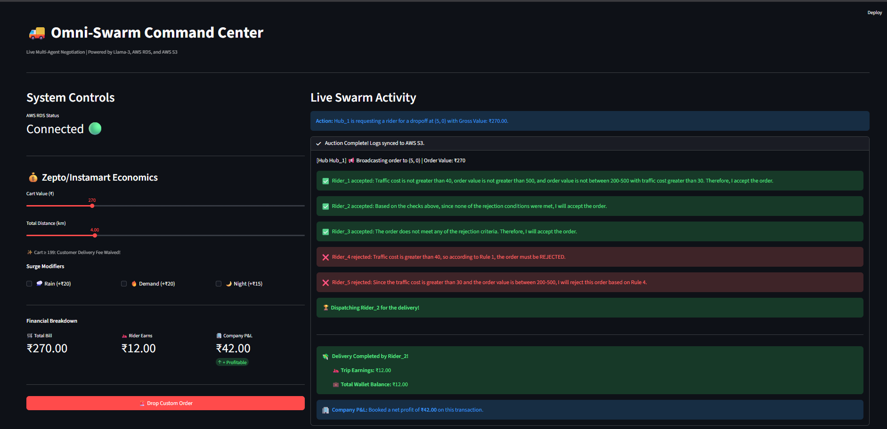

# 🚚 Omni-Swarm: Agentic Q-Commerce Economics

<p align="center">
  
  
  
  
</p>

<p align="center">
  <b>Multi-Agent AI system for Quick-Commerce dispatch, rider economics, and company profitability simulation.</b>
</p>

---

## 📌 Overview

**Omni-Swarm** is a production-style **Multi-Agent System (MAS)** that simulates real-time **10-minute grocery delivery operations**.

It combines:

* 🤖 Autonomous AI rider agents
* 🧠 LLM-powered dispatch reasoning
* ☁️ AWS cloud infrastructure
* 💰 Realistic unit economics
* 📊 Live operations dashboard

The platform models how modern quick-commerce companies balance:

* Customer charges
* Rider payouts
* Delivery costs
* Company profit / loss

---

## 📸 Product Screenshot

<p align="center">
  
</p>

---

# 🏗️ Architecture

```text
                    ┌────────────────────┐
                    │   Streamlit UI     │
                    │ Command Center     │
                    └─────────┬──────────┘
                              │
                              ▼
                    ┌────────────────────┐
                    │ Python Backend     │
                    │ Dispatch Engine    │
                    └─────────┬──────────┘
                              │
          ┌───────────────────┼───────────────────┐
          ▼                   ▼                   ▼
 ┌────────────────┐   ┌────────────────┐   ┌────────────────┐
 │ Ollama Llama3  │   │ AWS RDS        │   │ AWS S3         │
 │ Agent Reasoner │   │ World State DB │   │ Event Logs     │
 └────────────────┘   └────────────────┘   └────────────────┘
```

---

# 🧠 Core Components

## 1️⃣ The Brain (LLM Agent Layer)

Powered by **Ollama + Llama 3**

Each rider agent independently reasons on:

* Traffic cost
* Distance
* Order value
* Battery level
* Profitability

Then decides:

✅ Accept Order
❌ Reject Order

---

## 2️⃣ World State (AWS RDS)

Stores live simulation data:

* City nodes
* Hubs
* Riders
* Coordinates
* Orders
* Operational state

---

## 3️⃣ Black Box Logging (AWS S3)

Every action stored as JSON:

* Dispatch decisions
* Rider movements
* Earnings
* Profit events
* Failures

Useful for:

* Replay systems
* Dataset creation
* Reinforcement Learning

---

## 4️⃣ Command Center (Streamlit)

Live dashboard displays:

* Orders arriving
* Rider bidding
* Dispatch winner
* Rider wallets
* Company P&L

---

# 💰 Economic Engine

## Customer Billing

```text
Total Bill =
Cart Value
+ Distance Fee
+ Surge Fee
```

Surges may include:

* 🌧 Rain
* 🌙 Night
* 📈 High Demand

---

## Rider Payout Logic

```text
Rider Earnings =
40% of delivery fee
+ incentives (optional)
```

---

## Company Profit Formula

```text
Profit =
20% Product Margin
+ Delivery Fee Spread
+ Surge Spread
- Rider Payout
```

---

## ⚠️ Small Order Bleed

The simulator identifies situations where:

* Cart value is low
* Delivery is free
* Rider cost is high

Result:

```text
Negative Unit Economics
```

This mirrors real-world quick-commerce burn models.

---

# 🤖 Live Dispatch Example

```text
Action: Hub_1 requests rider for drop at (5,0)
Gross Order Value: ₹270

✅ Rider_1 Accepted
Reason: Traffic cost below threshold

❌ Rider_4 Rejected
Reason: Traffic cost too high

❌ Rider_5 Rejected
Reason: Low payout for medium order

🏆 Rider_2 Selected

💸 Delivery Completed
Trip Earnings: ₹12

🏢 Company Profit: ₹42
```

---

# 🛠️ Tech Stack

| Layer     | Technology           |
| --------- | -------------------- |
| AI Agents | Ollama + Llama3      |
| Backend   | Python               |
| UI        | Streamlit            |
| Database  | PostgreSQL (AWS RDS) |
| Storage   | AWS S3               |
| Logging   | JSON Pipelines       |

---

# ⚙️ Installation

## Clone Repository

```bash
git clone https://github.com/yourusername/omni-swarm.git
cd omni-swarm
```

---

## Install Requirements

```bash
pip install -r requirements.txt
```

Dependencies:

```text
streamlit
boto3
psycopg2-binary
python-dotenv
requests
```

---

## Environment Variables

Create `.env`

```env
DB_HOST=your-rds-endpoint.amazonaws.com
DB_NAME=your_db_name
DB_USER=your_db_user
DB_PASS=your_db_password
DB_PORT=5432

S3_BUCKET_NAME=your_bucket

AWS_ACCESS_KEY_ID=your_key
AWS_SECRET_ACCESS_KEY=your_secret
AWS_REGION=ap-south-1
```

---

## Run LLM Engine

```bash
ollama run llama3
```

---

## Launch App

```bash
streamlit run app.py
```

---

# 📈 Roadmap

## 🚚 Phase 5: Order Batching

Enable riders to deliver multiple orders in one trip using route optimization.

---

## 📊 Analytics Dashboard

Track:

* Daily Profit
* Rider Earnings
* Surge Windows
* Burn Zones
* Fulfillment Rate

---

## ☁️ Public Deployment

Move inference to:

* Groq
* Together AI
* GPU Cloud Hosting

Deploy Streamlit publicly.

---

# 🎯 Resume Value / Skills Demonstrated

✅ Multi-Agent Systems
✅ Agentic AI
✅ LLM Orchestration
✅ Real-Time Simulation
✅ Cloud Engineering
✅ Applied Economics Modeling
✅ Production Dashboards

---

# 👨‍💻 Author

**Satyartha Shukla**
AI Engineer • LLM Systems • Multi-Agent AI • Applied ML

---

<p align="center">
Built with Python, AI Agents, and Economic Chaos 🚀
</p>
